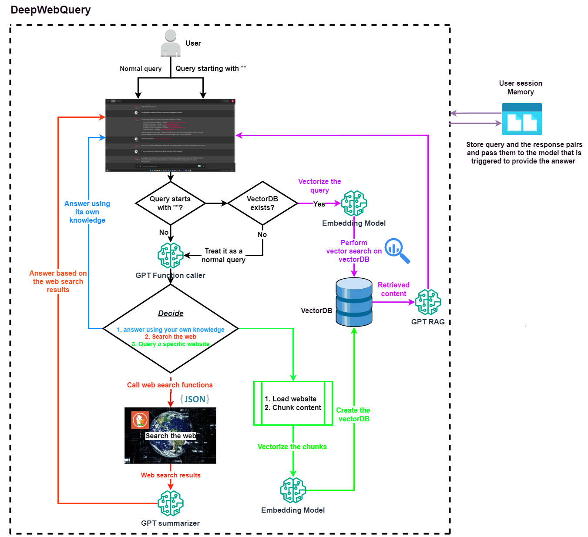

# DeepWebQuery: Combining WebGPT and RAG-GPT

**DeepWebQuery** is a chatbot that goes beyond typical internet searches. Built on the foundations of WebGPT and RAG-GPT, this project empowers users to delve into the depths of both general knowledge and specific URL content.

#### Key Features:
* Intelligent Decision-Making: Our model intelligently decides whether to answer user queries based on its internal knowledge base or execute relevant Python functions.
* Dynamic Functionality: Identify and execute the most pertinent Python functions in response to user queries, expanding the scope of what the chatbot can achieve.
* Web-Integrated Responses: The second GPT model seamlessly combines user queries with content retrieved from web searches, providing rich and context-aware responses.
* Website-Specific Queries: When users inquire about a specific website, the model dynamically calls a function to load, vectorize, and create a vectordb from the site's content.
* Memory: DeepWebQuery boasts a memory feature that allows it to retain information about user interactions. This enables a more coherent and context-aware conversation by keeping track of previous questions and answers.
* Vectordb Interactions: Users can query the content of the vectordb by starting their questions with ** and exit the RAG conversation by omitting ** from the query. ** can trigger the third GPT model for RAG Q&A.
* Chainlit Interface: The user-friendly interface is built using Chainlit, enhancing the overall user experience.
* Diverse Search Capabilities: DeepWebQuery supports a variety of searches, including text, news, PDFs, images, videos, maps, and instant responses.
* Overcoming Knowledge-Cutoff Limitations: This chatbot transcends knowledge-cutoff limitations, providing answers based on the latest internet content and even allowing users to ask questions about webpage content.

## Chainlit User Interface
<div align="center">
  
</div>

### Fact check:
<div align="center">
  
</div>

### LLM function caller log for the first query shown in chainlit user interface image 
<div align="center">
  
</div>

### LLM function caller log for the second query shown in chainlit user interface image 
<div align="center">
  
</div>

## Project Schema
<div align="center">
  
</div>

## Running the Project

To get the project up and running, you'll need to set up your environment and install the necessary dependencies. You can do this in two ways:

### Option 1: Using the Parent Directory Instructions

Follow the instruction on the [parent directory](https://github.com/Farzad-R/LLM-playground/tree/master) to create an environment and install required libraries. 

### Option 2: Installing Dependencies Individually
If you prefer to install the dependencies individually, run the following command:

```
pip install chainlit==0.7.700 duckduckgo-search==3.9.6 openai==0.28.0 chromadb==0.4.18 fake-useragent==1.4.0
```

1. **Configuration and Execution**
* Navigate to the config directory.
* Open cfg.py and fill in your GPT API credentials.
2. **Activate Your Environment.**
3. **Ensure you are in the DeepWebQuery directory**
4. **Run the Application:**

In Terminal:

```
chainlit run app.py -h
```

The project includes an automatic directory creation feature within the DeepWebQuery directory. Specifically, it generates two folders:

1. `memory`: This directory is designed to store essential information for each user session. It will create and maintain a separate CSV file for each session, preserving the chat history.
2. `vectordb`: This directory is dedicated to holding chromaDB folders, each corresponding to a specific URL requested by the user. At the onset of each session, this folder is regenerated, ensuring a clean slate. Any existing vectorDBs from previous sessions are automatically purged to maintain a tidy and up-to-date workspace.

YouTube video:
- [Link](Coming soon)

Slides:
- [Link](https://github.com/Farzad-R/LLM-Zero-to-Hundred/blob/master/presentation/slides.pdf)

Extra read:
- [GPT model](https://platform.openai.com/docs/models/overview) 
- [duckduckgo-search](https://pypi.org/project/duckduckgo-search/)
- [chainlit](https://docs.chainlit.io/get-started/overview)


