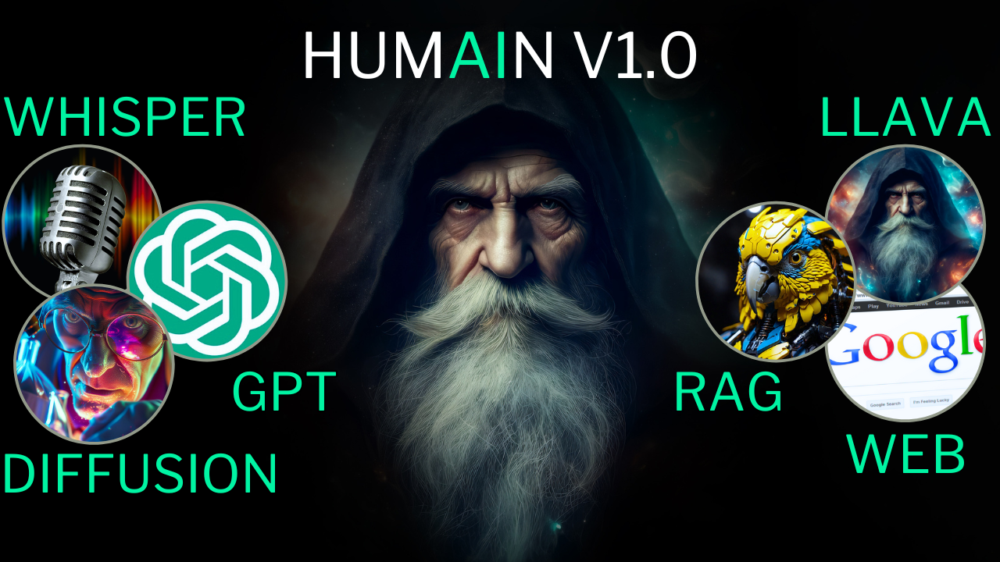
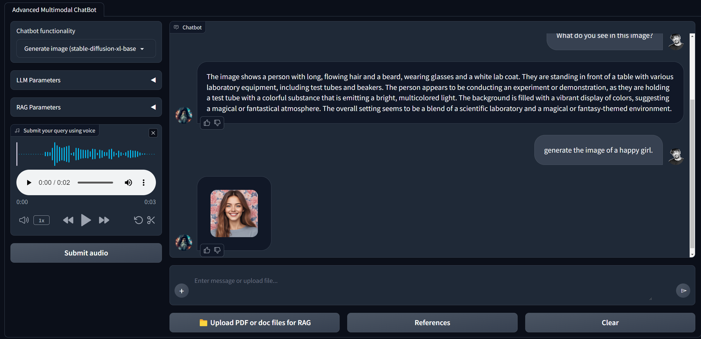

# Advanced Multimodal Chatbot Readme

Welcome to my advanced multimodal chatbot! Here's a breakdown of what it can do and how to get it up and running.
## HUMAIN multi-modal multi-task chatbot
<div align="center">
  
</div>

## Features:
- ChatGPT-like interaction: Chatbot can act as a normal AI assistant.
- RAG (Retrieval Augmented Generation) capabilities: The chatbot can perform RAG in 3 different ways 
  1. With preprocessed documents
  2. Documents that the user uploads while using the chatbot
  3. Any webiste that the user requests.
- Image generation: Chatbot utilizes a stable diffusion model to generate images.
- Image understanding: Chatbot Understands the content of images and can answer user's question based on the content of the image using the LLava model.
- DuckDuckGo integration: Access the DuckDuckGo search engine to provide answers based on search results when needed.
- Summarization: Summarize website content or documents upon user request.
- Text and voice interaction: Interact with chatbot through both text and voice inputs.
- Memory: The GPT models in the chatbot also have access to the memory (user's previous queries during the current session).

NOTE: This chatbot includes both the RAG-GPT and WebRAGQuery projects.

**YouTube video:** [Link](https://youtu.be/AAvqscJPXIY?si=ApZ9-WfFfyGbcd-H)

## Main underlying techniques used in this chatbot:
- LLM chains and agents
- GPT function calling
- Retrieval Augmented generation (RAG)

## Models used in this chatbot:
- GPT 3.5: [Website](https://platform.openai.com/docs/models)
- text-embedding-ada-002: [Website](https://platform.openai.com/docs/models)
- llava-hf/llava-v1.6-mistral-7b-hf: [Code](https://github.com/haotian-liu/LLaVA) - [Demo](https://llava.hliu.cc/) - [Website](https://llava-vl.github.io/blog/2024-01-30-llava-next/) - [Models](https://github.com/haotian-liu/LLaVA/blob/main/docs/MODEL_ZOO.md#llava-v16)
- stabilityai/stable-diffusion-xl-base-1.0 : [Website](https://huggingface.co/stabilityai/stable-diffusion-xl-base-1.0)
- openai/whisper-base.en: [Website](https://huggingface.co/openai/whisper-base.en)

## Requirements:
- Operating System: Linux OS or Windows Subsystem for Linux (WSL).
- GPU VRAM: Minimum 15 GB for full execution.
- OpenAI or Azure OpenAI Credentials: Required for GPT functionality.

## Installation:
- Ensure you have Python installed along with required dependencies.
```
sudo apt update && sudo apt upgrade
python3 -m venv chatbot-env
git clone <the repository>
```
cd multimodal-chatbot
```
source ...Path to the environment/chatbot-env/bin/activate
pip install -r requirements.txt
```
- No need to download model weights separately; all models are accessed directly from the HuggingFace hub.

## Execution:

To prepare Documents for RAG, Copy PDF files to `data/docs` directory and execute:
```
python src/prepare_vectordb_from_docs.py.
```

### Chatbot one-Click Execution:
Run the provided script: 
```
./run_chatbot.sh
```
### Accessing the Chatbot UI:
Visit http://127.0.0.1:7860 in your web browser after executing the command.

### Stopping the Chatbot:
- Detach from Session:
Press Ctrl + b, then release both keys and press d.
- To terminate Session in the terminal, execute: 
```
tmux kill-session -t chatbot
```

### Manual Execution:
Terminal One: RAG Reference Service
```
python src/utils/web_servers/rag_reference_service.py
```
Terminal Two: LLava Service
```
python src/utils/web_servers/llava_service.py
```
Terminal Three: Stable Diffusion Service
```
python src/utils/web_servers/sdxl_service.py
```
Terminal Four: Speech-to-Text Service
```
python src/utils/web_servers/stt_service.py
```
Launch Chatbot Interface in terminal five:
```
python src/app.py
```
or
```
gradio src/app.py
```

## Chatbot User Interface
<div align="center">
  
</div>


## Project Schema
<div align="center">
  
</div>

## Key frameworks/libraries used in this chatbot:
- Langchain: [introduction](https://python.langchain.com/docs/get_started/introduction)
- Duckduckgo search engine: [Documentation](https://pypi.org/project/duckduckgo-search/)
- Gradio: [Documentation](https://www.gradio.app/docs/interface)
- OpenAI: [Developer quickstart](https://platform.openai.com/docs/quickstart?context=python)
- Transformers: [Documentation](https://huggingface.co/docs/transformers/en/index)
- chromadb: [Documentation](https://docs.trychroma.com/)
- bs4: [Documentation](https://beautiful-soup-4.readthedocs.io/en/latest/)