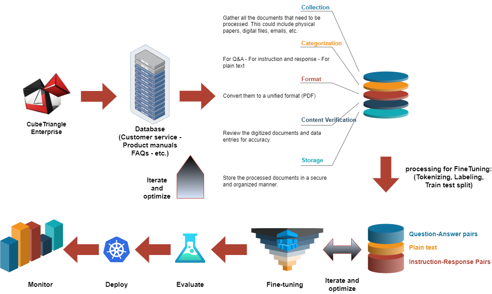
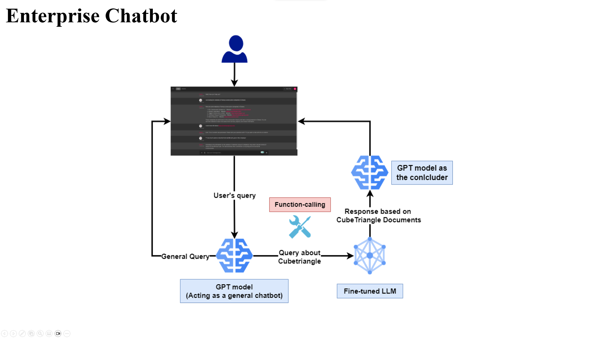

# Fine-tuning: Fine-tuning LLMs on dataset of a fictional company

We use a fictional company called Cubetriangle and design the pipeline to process its raw data, finetune 3 large language models (LLMs) on it, and design a chatbot using the best model.

### The models that I used in this video are:
* Pythia_70m: https://huggingface.co/EleutherAI/pythia-70m
* dlite_v2_1.5b: https://huggingface.co/aisquared/dlite-v2-1_5b
* Open_llama_3b: https://huggingface.co/openlm-research/open_llama_3b
 

## Fine-tuning process schema

  

## Chatbot Schema

  

**YouTube video:** [Link](https://www.youtube.com/watch?v=_g4o21A6AY8&t=1154s)

**Slides:** [Link](https://github.com/Farzad-R/LLM-Zero-to-Hundred/blob/master/presentation/presentation.pdf)

**Extra read:**
- For understanding how to get the llama2 models and use them, please src/convert_llama_models/LLAMA_preparation.txt.
- For finding the list of good datasets and LLMs, check extra_resources/Resources.md.
