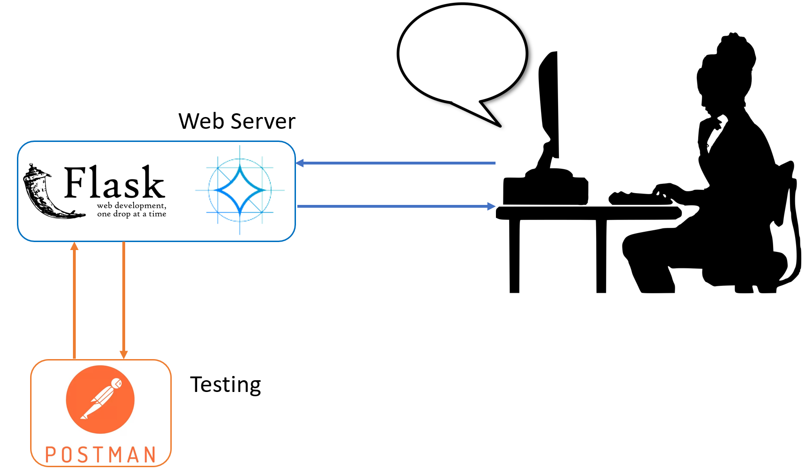

# RAG-Gemma: Retrieval Augmented generation chatbot By Integrating Google Gemma 7B LLM, BAAI/bge-large-en, Langchain, ChromaDB, and Gradio

**The chatbot offers versatile usage through two distinct methods:**
1. **Offline Documents**: Engage with documents that you've pre-processed and vectorized. These documents can be seamlessly integrated into your chat sessions.
2. **Real-time Uploads:** Easily upload documents during your chat sessions, allowing the chatbot to process and respond to the content on-the-fly.

* The project provides guidance on configuring various settings, such as adjusting the Gemma model's temperature, top_p, and top_k for optimal performance.
* The user interface is designed with gradio, ensuring an intuitive and user-friendly experience.
* For each response, you can access the retrieved content along with the option to view the corresponding PDF. 

## RAG-Gemma Schema
<div align="center">
  
</div>

## LLM serving schema
<div align="center">
  
</div>

* NOTE: This project is currently set up as a **demo**. As such, the document management is simplified and not suitable for production environments.

## Document Storage
Documents are stored in two separate folders within the `data` directory:
- `data/docs_2`: For files that you want to **upload**.
- `data/docs`: For files that should be **processed in advance**.

## Server Setup
The `llm_serve.py` module uses FLask to run a **web server** that serves the LLM for real time inferencing.
The `reference_serve.py` module leverages these folders to create an **HTTPS server** that hosts the PDF files, making them accessible for user viewing.

## Database Creation
Vector databases (vectorDBs) are generated within the `data` folder, facilitating the project's functionality.

## Important Considerations
- The current file management system is intended for **demonstration purposes only**.
- It is **strongly recommended** to design a more robust and secure document handling process for any production deployment.
- Ensure that you place your files in the correct directories (`data/docs_2` and `data/docs`) for the project to function as intended.

## Running the Project
To get the project up and running, you'll need to set up your environment and install the necessary dependencies. You can do this in two ways:

### Option 1: Using the Parent Directory Instructions
Follow the instruction on the [parent directory](https://github.com/Farzad-R/LLM-playground/tree/master) to create an environment and install required libraries. 

### Option 2: Installing Dependencies Individually
If you prefer to install the dependencies individually, run the following command:

```
pip install transformer flask gradio langchain pyprojroot chromadb pypdf pandas torch python-dotenv PyYAML
```

2. **Activate Your Environment.**
3. **Ensure you are in the open-source-RAG-Gemma directory**
4. **Run the Application:**
before running the chatbot execute:
```
python src\upload_data_manually.py
```
Then:
In Terminal 1:
```
python src\reference_serve.py
```

In Terminal 2:
```
python src\llm_service.py
```

In Terminal 3:
```
python src\app.py
```

5. Chat with your documents.

**YouTube video: [Link](https://youtu.be/6dyz2M_UWLw?si=E2Ep0dDNYpixzrBS) **

Extra read:
- [RAG-GPT video](https://www.youtube.com/watch?v=1FERFfut4Uw&t=676s)
- [BAAI/bge-large-en](https://huggingface.co/BAAI/bge-large-en)
- [Google Gemma](https://huggingface.co/blog/gemma)
- [Quantization](https://huggingface.co/docs/transformers/main_classes/quantization)
- [Lost in the Middle Paper](https://arxiv.org/abs/2307.03172)
- [Gradio](https://www.gradio.app/guides/quickstart)
- [Langchain](https://python.langchain.com/docs/get_started/quickstart)
- [ChromaDB](https://www.trychroma.com/)