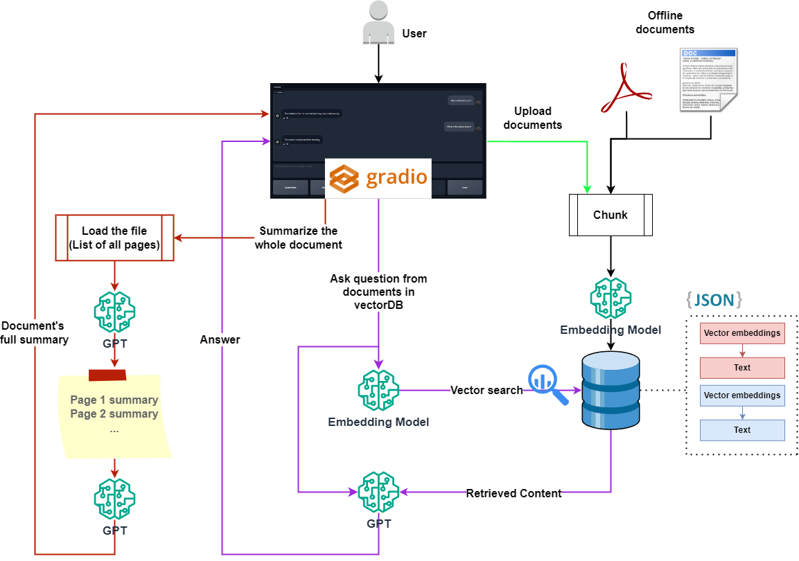

# RAG-GPT: Retrieval Augmented generation (RAG) chatbot using OpenAI GPT Model, Langchain, ChromaDB, and Gradio

**RAG-GPT** supports both PDFs and Docs. 

**The chatbot offers versatile usage through three different methods:**
1. **Offline Documents**: Engage with documents that you've pre-processed and vectorized. These documents can be seamlessly integrated into your chat sessions.
2. **Real-time Uploads:** Easily upload documents during your chat sessions, allowing the chatbot to process and respond to the content on-the-fly.
3. **Summarization Requests:** Request the chatbot to provide a comprehensive summary of an entire PDF or document in a single interaction, streamlining information retrieval.

To employ any of these methods, simply configure the appropriate settings in the "RAG with" dropdown menu within the chatbot interface. Tailor your interactions with documents to suit your preferences and needs efficiently.

* The project provides guidance on configuring various settings, such as adjusting the GPT model's temperature for optimal performance.
* The user interface is crafted with gradio, ensuring an intuitive and user-friendly experience.
* The model incorporates memory, retaining user Q&As for an enhanced and personalized user experience.
* For each response, you can access the retrieved content along with the option to view the corresponding PDF. 

## RAG-GPT User Interface
<div align="center">
  
</div>

## Project Schema
<div align="center">
  
</div>

* NOTE: This project is currently set up as a **demo**. As such, the document management is simplified and not suitable for production environments.

## Document Storage
Documents are stored in two separate folders within the `data` directory:
- `data/docs_2`: For files that you want to **upload**.
- `data/docs`: For files that should be **processed in advance**.

## Server Setup
The `serve.py` module leverages these folders to create an **HTTPS server** that hosts the PDF files, making them accessible for user viewing.

## Database Creation
Vector databases (vectorDBs) are generated within the `data` folder, facilitating the project's functionality.

## Important Considerations
- The current file management system is intended for **demonstration purposes only**.
- It is **strongly recommended** to design a more robust and secure document handling process for any production deployment.
- Ensure that you place your files in the correct directories (`data/docs_2` and `data/docs`) for the project to function as intended.

## Running the Project

To get the project up and running, you'll need to set up your environment and install the necessary dependencies. You can do this in two ways:

### Option 1: Using the Parent Directory Instructions

Follow the instruction on the [parent directory](https://github.com/Farzad-R/LLM-playground/tree/master) to create an environment and install required libraries. 

### Option 2: Installing Dependencies Individually
If you prefer to install the dependencies individually, run the following command:

```
pip install gradio==4.13.0 langchain==0.0.354 openai==0.28.0 chromadb==0.4.22 pypdf==3.17.4 pandas==2.1.4
```

1. **Configuration and Execution**
* Open cfg.py and fill in your GPT API credentials.

2. **Activate Your Environment.**
3. **Ensure you are in the RAG-GPT directory**
4. **Run the Application:**

In Terminal 1:
```
python src\serve.py
```

In Terminal 2:
```
python src\raggpt_app.py
```
5. Chat with your documents.

**YouTube video: **[Link](https://www.youtube.com/watch?v=1FERFfut4Uw&t=3s)

**Slides:** [Link](https://github.com/Farzad-R/LLM-Zero-to-Hundred/blob/master/presentation/presentation.pdf)

Extra read:
- [GPT model](https://platform.openai.com/docs/models/overview) 
- [Gradio](https://www.gradio.app/guides/quickstart)
- [Langchain](https://python.langchain.com/docs/get_started/quickstart)
- [ChromaDB](https://www.trychroma.com/)