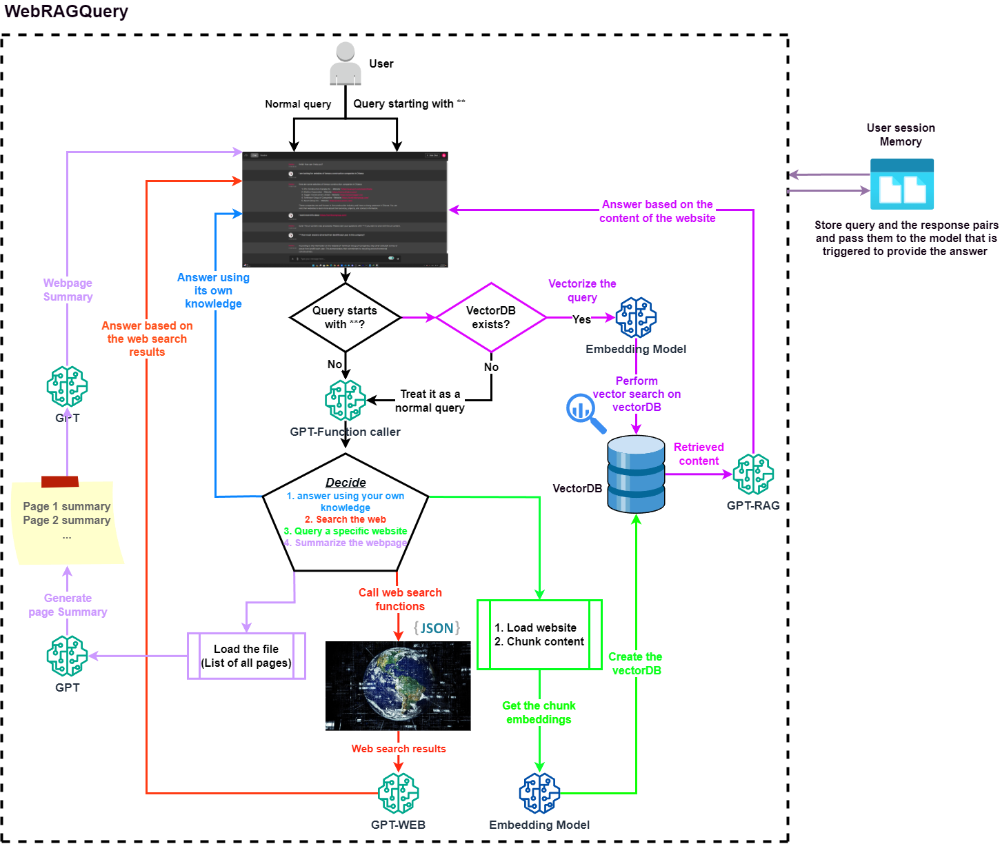

# RAGMaster: Langchain vs Llama-index

**RAGMaster** is a project where I compare the performance of 4 famous RAG techniques which have been proposed by Langchain and Llama-index. The test is being done on `40` questions aorund `6` different documents. Moreover, the projects provides `2` separate chatbot that can work with various techniques of each approach.

* The techniques that are compare in the repository are:

1. langchain: with RecursiveCharacterTextSplitter (chunk_size:1500, chunk_overlap:500) and search_type=similarity.
2. langchain: with RecursiveCharacterTextSplitter (chunk_size:1500, chunk_overlap:500) and search_type=mmr.
3. langchain: with TokenTextSplitter (chunk_size:1500, chunk_overlap:500) and search_type=mmr.
4. llama_index's sentence_retrieval technique with sentence_window_size: 3, similarity_top_k: 6, and rerank_top_n: 2.
5. llama_index's auto_merging_retrieval technique with chunk_sizes: [2048, 512, 128], similarity_top_k: 6, and rerank_top_n: 2.
6. llama_index's basic RAG: 

* The documents that are considered for the test are:

1. stories.pdf: Contains 3 simple short stories. (`5` questions)
2. Product specifications.pdf: Contains `30` fictional product names and their features. (`5` questions)
3. technical support.pdf: Contains `20` Q&A simulating the technical support of a company. (`5` questions)
4. VisionTransformer.pdf: Serves as the `1` column scientific paper. (`10` questions)
5. SegmentAnything.pdf: Serves as the `2` columns scientific paper. (`10` questions) 

**IMPORTANT NOTE**: llama-index and langchain require different dependencies in their backend which are not compatible with each other. Therefore, to make this comparison happen, I decded to keep both of them along with their techniques in the same project folder, but use two python separate environments. Inevitably, for oing through the project we have to switch between the environments. Therefore, I have provided two requirements file that you can use for setting up the environments (I am using windows 11 64bit).

* To prepare the llama-index environment:
1. Create a new environment 
2. Run:
```
pip install -r llama_index_env_requirements.txt
```
* To prepare the langchain environment:
1. Create a new environment 
2. Run:
```
pip install -r langchain_env_requirements.txt
```

## Create the vector databases:
From projoot root directory:

1. Activate the environment for llama_index, and run:

```
python src\llama_index\prepare_indexes.py
```

This code will create `4` indexes in `data\indexes` folder:
- basic_index
- merging_index
- pagewise_index
- sentence_index


2. Activate the environment for langchain, and run:

```
python src\langchain\prepare_vectordb.py
```

This code will prepare `1` index in index in `data\indexes` folder:
- langchain_index

## Test chatbots:
After preparing indexes, you can use the chtabots.

* To use llama_index chatbot:
I. Activate llama_index environment
II. In the terminal, run:

```
chainlit run src\llama_index\chatbot.py
```

This command will open the chatbot on port 8000 of your browser. llama-index chatbot is designed using the Chainlit user interface.
In the chatbot settings, `4` different RAG techniques are provided for you to select and chat with the chatbot.
1. page-wise RAG: Each page was considered as a separate chunk for creating the vector database.
3. Sentence Retrieval
4. Auto-merging retrieval

* To use langchain chatbot:
I. Activate langchain environment
II. In the terminal, run:

```
chainlit run src\langchain\chatbot.py
```
This command will open the chatbot on port 8000 of your browser. You have the ability to select the search technique that you want to activate in the backend, using the setting section, and chat with the chatbot. For further information about chainlit, please visit their website.

## Chatbots:
**llama-index chatbot:**

**langchain chatbot:**
Unleash the potential of the #RAG technique by sharing a website link with the chatbot. Initiate in-depth discussions and pose detailed questions about the content of the specified website.

## Run the evaluation pipeline:
### Prerequisites for evaluation
* Indexes should have been created in `data` folder.
* There should be an excel file named `eval_ds.xlsx` in `data\eval_questions` folder. To understand the structure of the excel file, please check the provided sample excel file or watch the youtube video here.
### When prerequisites are ready
I. Activate llama_index environment, run the following command once for each of these two configs (you will run the modules two times in total):
- set llama_eval_method="auto_merging_retrieval"
- Set llama_eval_method="sentence_retrieval"

In teminal run:

```
python src\evaluate_rag_techniques\run_llama_index.py
```

* This code will update `llama_index_sentence_retrieval_result` and `llama_index_auto_merging_retrieval_result` columns in the excel file.

II. Activate langchain environment and run the following command once for each of these two configs (you will run the modules two times in total):
- set search_type="similarity"
- Set search_type="mmr"

In teminal run:

```
python src\evaluate_rag_techniques\run_langchain.py
```

* This code will update `langchain_similarity_result` and `langchain_mmr_result` columns in the excel file.

### When the excel file got updated with the previous 4 steps

In the terminal run:
```
python src\evaluate_rag_techniques\run_gpt_eval.py
```
* This code will update 
`langchain_mmr_score`, `llama_index_sentence_retrieval_score`, `llama_index_auto_merging_retrieval_score`, `lowest_score`,
and `highest_score` columns in the excel file.

## Observe the performance
To check and see the performance, check `src\check_final_results.ipynb` notebook.

## ALl commands at once:
```
pip install -r llama_index_env_requirements.txt
pip install -r langchain_env_requirements.txt
python src\llama_index\prepare_indexes.py
python src\langchain\prepare_vectordb.py
chainlit run src\llama_index\chatbot.py
chainlit run src\langchain\chatbot.py
python src\evaluate_rag_techniques\run_llama_index.py
python src\evaluate_rag_techniques\run_langchain.py
python src\evaluate_rag_techniques\run_gpt_eval.py
```
## Chainlit User Interface
<div align="center">
  
</div>

### Tomlinson Website:
<div align="center">
  
</div>

### LLM function caller log for the first query shown in chainlit user interface image 
<div align="center">
  
</div>

### LLM function caller log for the second query shown in chainlit user interface image 
<div align="center">
  
</div>

## Project Schema
<div align="center">
  
</div>

## YouTube video:
- [Link](Coming soon)

## Slides:
- [Link](https://github.com/Farzad-R/LLM-Zero-to-Hundred/blob/master/presentation/presentation.pdf)

## Extra read:
- [GPT model](https://platform.openai.com/docs/models/overview) 
- [duckduckgo-search](https://pypi.org/project/duckduckgo-search/)
- [chainlit](https://docs.chainlit.io/get-started/overview)
- [Langchain](https://python.langchain.com/docs/get_started/quickstart)
- [ChromaDB](https://www.trychroma.com/)


