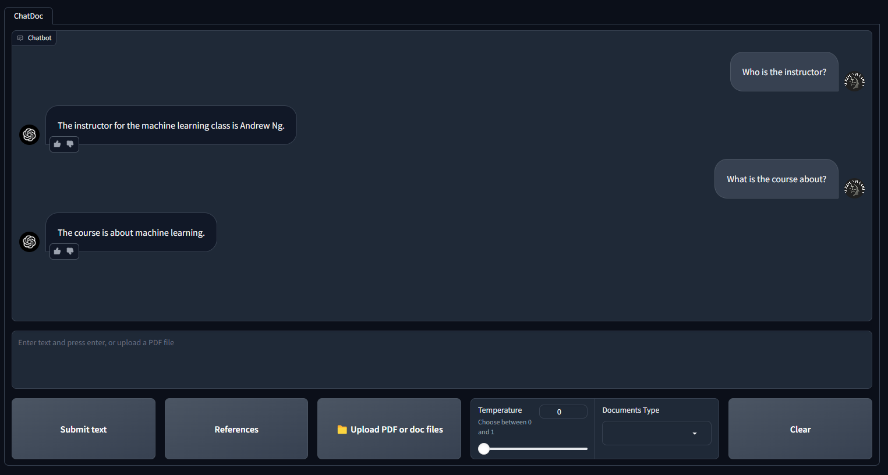
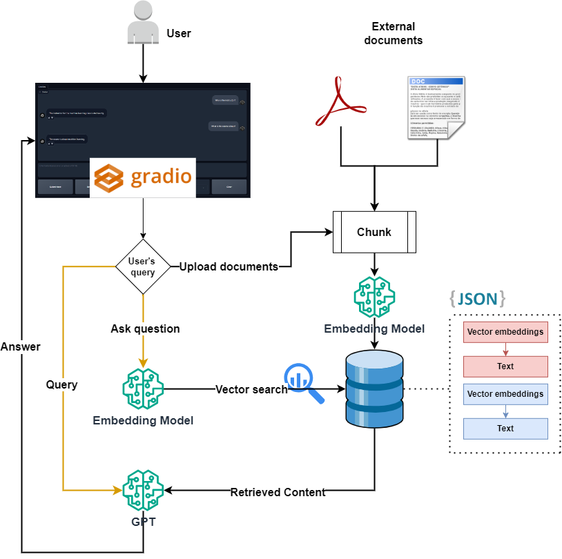

# Designing a User Interface for Retrieval Augmented Generation Using GPT Model, Langchain, ChromaDB, and Gradio

**RAG-GPT** is a chatbot that enables you to chat with your documents (PDFs and Doc). The project works with two types of data:
1. With documents that you have vectorized and processed beforehand.
2. With documents that you upload while chatting with the model.

## Streamlit user interface:
<div align="center">
  
</div>

## Project schema:
<div align="center">
  
</div>

## To run the project:

First, follow the instruction on the [parent directory](https://github.com/Farzad-R/LLM-playground/tree/master) to create an environment and install required libraries. 

Or install the dependencies individually:

```
pip install gradio==4.5.0 langchain==0.0.339 openai==0.28.0 chromadb==0.4.18 PyYAML pypdf==3.17.1
```

Then:

1. Fill in your GPT API credentials in config/cfg.py
2. activate your environment
3. Open the terminal. Make sure you are in the WebGPT directory and run:
```
python gradio_app.py
```

YouTube video:
- [Link](Coming soon)

Presentation:
- [Link](https://github.com/Farzad-R/LLM-playground/tree/master/WebGPT/presentation/slides.pdf)

Extra read:
- [GPT model](https://platform.openai.com/docs/models/overview) 
- [Gradio](https://www.gradio.app/guides/quickstart)
- [Langchain](https://python.langchain.com/docs/get_started/quickstart)
- [ChromaDB](https://www.trychroma.com/)