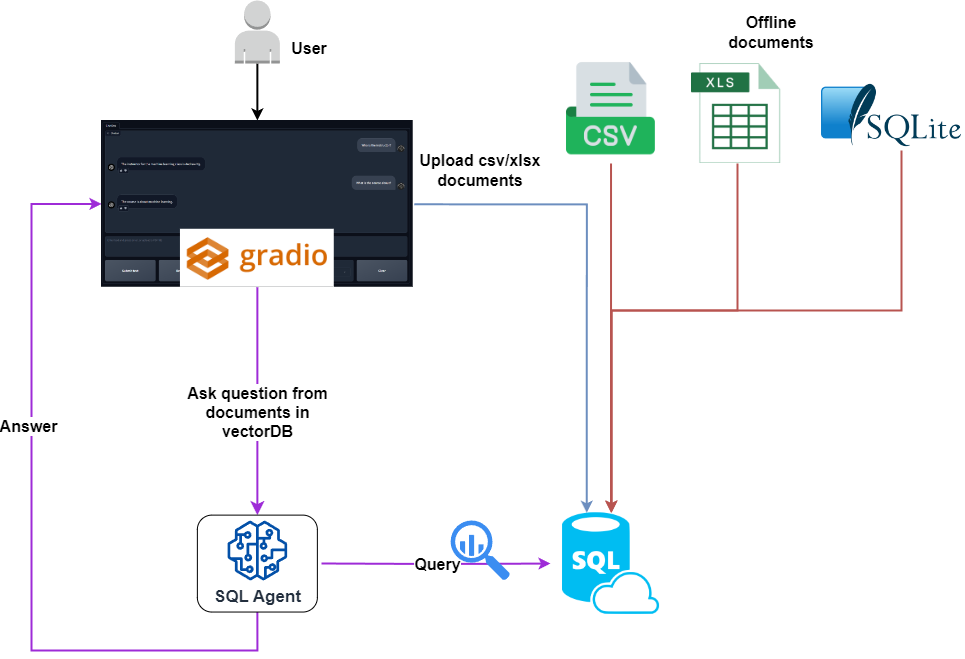
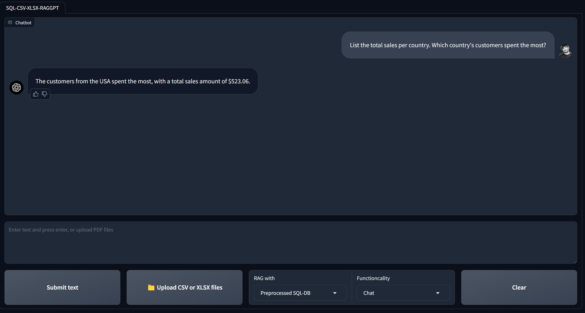

# SQL - CSV - XLSX RAG-GPT

Welcome to SQL RAG-GPT. This chatbot is RAG-GPT's modified version to work with tabular datasets (SQL, CSV, and XLSX).

## Features:
- Chat with SQL data.
- Chat with preprocessed CSV and XLSX data.
- Chat with uploaded CSV and XSLX files during the interaction with the user interface. 

**YouTube video:** TBD

## Main underlying techniques used in this chatbot:
- LLM chains and agents
- GPT function calling
- Retrieval Augmented generation (RAG)

## Models used in this chatbot:
- GPT 3.5: [Website](https://platform.openai.com/docs/models)

## Requirements:
- Operating System: Linux OS or Windows. (I am running the project on Linux WSL for windows)
- OpenAI or Azure OpenAI Credentials: Required for GPT functionality.

## Installation:
- Ensure you have Python installed along with required dependencies.
```
sudo apt update && sudo apt upgrade
python3 -m venv sql-raggpt-env
git clone <the repository>
cd SQL-RAG-GPT
source ...Path to the environment/sql-raggpt-env/bin/activate
pip install -r requirements.txt
```
## Execution:

1. To prepare the SQL DB from a `.sql` file, Copy the file into `data/sql` directory and in the terminal, from the project folder, execute:
```
sudo apt install sqlite3
cd data
```

Now create a database called `sqldb`:
```
sqlite3 data/sqldb.db
.read data/sql/<name of your sql database>.sql
```

This command will create a SQL database named `sqldb.db` in the `data` directory. Verify that it created the database
```
SELECT * FROM <name of any column in your sql database> LIMIT 10;
```
2. To prepare a SQL DB from your CSV and XLSX files, copy your files in `data/csv_xlsx` and in the terminal, from the project folder, execute:
```
python src/prepare_csv_xlsx_db.py.
```

This command will create a SQL database named `csv_xlsx_sqldb.db` in the `data` directory.

3. To upload your datasets and chat with them during the interaction with the user interface:
- Change the chat functioncality to `Process files`
- Upload you files and wait for the message indicating the the database is ready.
- Switch back the chat functioncality to `Chat`
- Change the RAG with dropdown to `Uploaded files`.
- Start chatting.


## Project Schema
<div align="center">
  
</div>

## Chatbot User Interface
<div align="center">
  
</div>

## Databases:
- Diabetes dataset: [Link](https://www.kaggle.com/datasets/akshaydattatraykhare/diabetes-dataset?resource=download&select=diabetes.csv)
- Cancer dataset: [Link](https://www.kaggle.com/datasets/rohansahana/breast-cancer-dataset-for-beginners?select=train.csv)
- Chinook database: [Link](https://database.guide/2-sample-databases-sqlite/)

## Key frameworks/libraries used in this chatbot:
- Langchain: [introduction](https://python.langchain.com/docs/get_started/introduction)
- Gradio: [Documentation](https://www.gradio.app/docs/interface)
- OpenAI: [Developer quickstart](https://platform.openai.com/docs/quickstart?context=python)
- SQLAlchemy [Documentation](https://www.sqlalchemy.org/)