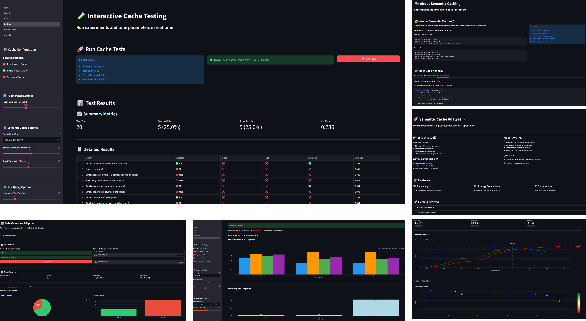
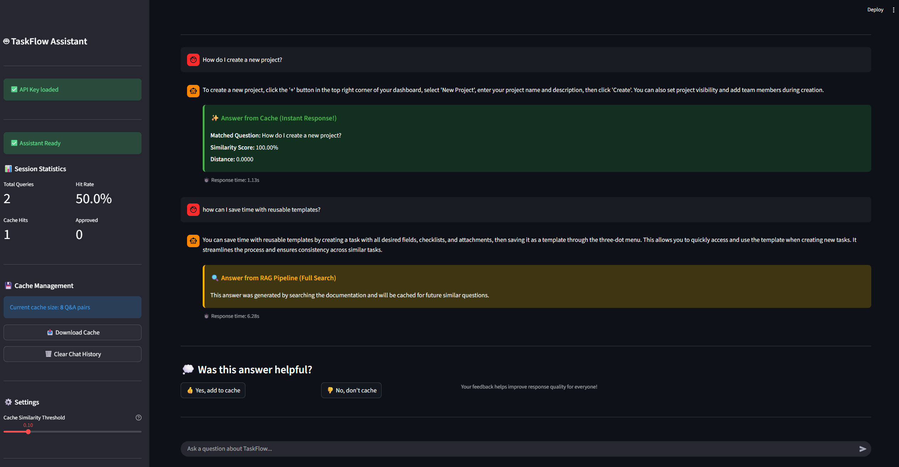
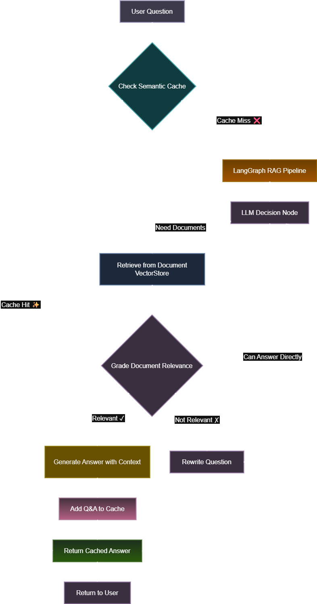

# 🚀 Semantic Caching for LLM Applications

A comprehensive project demonstrating how semantic caching dramatically improves LLM application performance by reducing latency and API costs through intelligent question-answer matching.

[](https://www.youtube.com/@airoundtable)

---

## 📺 Video Tutorial

**Watch the full walkthrough:**  
[🎥 YouTube Link - Semantic Caching Deep Dive](YOUR_YOUTUBE_LINK_HERE)

---

## 🎯 What is Semantic Caching?

Traditional caching uses exact string matching - your query must be identical to get a cached response. **Semantic caching** understands meaning:

```
Original: "How do I reset my password?"
Matches:  "I forgot my password, how do I recover it?" ✓
          "Password recovery steps?" ✓
          "Reset password process?" ✓
```

**The Impact:**
- ⚡ **20-50x faster** responses (0.4s vs 10s)
- 💰 **90% cost reduction** (embeddings vs full LLM calls)
- 🎯 **Better UX** with instant answers for similar questions

---

## 📊 Project Overview

This repository contains three components:

### 1. 📓 **Tutorial** - Interactive Learning
Step-by-step Jupyter notebook teaching semantic caching fundamentals with hands-on examples.

### 2. 🧪 **Evaluation Dashboard** - Testing & Optimization
Interactive Streamlit dashboard for evaluating cache strategies, optimizing thresholds, and comparing embedding models.



### 3. 🤖 **RAG Chatbot Demo** - See It In Action
Production-ready chatbot combining RAG with semantic caching, showing real-time cache hits and performance metrics.



<p align="center">
  
</p>


---

## 🗂️ Repository Structure

```
semantic-caching/
│
├── tutorial/                           # 📓 Learning materials
│   └── semantic_caching_walkthrough.ipynb
│
├── evaluation_dashboard/               # 🧪 Testing & optimization tool
│   ├── app.py
│   ├── pages/
│   │   ├── 1_about.py
│   │   ├── 2_data.py
│   │   ├── 3_testing.py
│   │   ├── 4_optimization.py
│   │   └── 5_reranker.py
│   ├── src/cachelab/
│   │   ├── cache/                      # Cache implementations
│   │   ├── evaluate/                   # Evaluation framework
│   │   ├── reranker/                   # Reranking strategies
│   │   └── utils/                      # Utilities
│   ├── data/                           # Sample datasets
│   ├── pyproject.toml
│   └── README.md
│
├── rag_agent_with_cache/              # 🤖 Production demo
│   ├── streamlit_app.py
│   ├── cached_rag_chatbot_chroma.py
│   ├── semantic_cache.py
│   ├── document_store_chroma.py
│   ├── prepare_data_chroma.py
│   ├── data/
│   │   ├── chroma_db/
│   │   ├── taskflow_faq.csv
│   │   └── taskflow_cache_seed.csv
│   └── README.md
│
└── documentation/                      # 📖 Additional resources
    ├── presentation.pdf
    ├── dashboard_screenshot.png
    └── chatbot_screenshot.png
```

---

## 🚀 Quick Start

### Prerequisites
- Python 3.11+
- OpenAI API key (for RAG demo)

### 1️⃣ Tutorial (Start Here!)

Learn the fundamentals through interactive examples:

```bash
cd tutorial
jupyter notebook semantic_caching_walkthrough.ipynb
```

**What you'll learn:**
- How semantic similarity works
- Different caching strategies (exact, fuzzy, semantic)
- Threshold optimization
- Real-world applications

---

### 2️⃣ Evaluation Dashboard

Test and optimize your cache configuration:

```bash
cd evaluation_dashboard

# Install
pip install -e .

# Run
streamlit run app.py
```

**What you can do:**
- Upload your own FAQ datasets
- Compare exact, fuzzy, and semantic caching
- Test different embedding models
- Find optimal similarity thresholds
- Analyze precision/recall trade-offs
- Export production-ready configurations

**Dataset format:**
- `ground_truth.csv` - Your FAQ knowledge base
- `test_dataset.csv` - Test queries with expected results

---

### 3️⃣ RAG Chatbot Demo

See semantic caching in production:

```bash
cd rag_agent_with_cache

# Install dependencies
pip install -r requirements.txt

# Set API key
export OPENAI_API_KEY='your-key'

# Create vectorstore (one time)
python prepare_data_chroma.py

# Run chatbot
streamlit run streamlit_app.py
```

**Try asking:**
- "How do I create a new project?" ⚡ Cache hit (~0.4s)
- "What's the cost?" ⚡ Cache hit (~0.4s)
- "How do I set up automations?" 🔍 RAG search (~5s)

**Features:**
- Real-time cache hit/miss indicators
- Performance comparison (cache vs RAG)
- User feedback loop (approve answers to cache them)
- Session statistics tracking

---

## 📈 Performance Comparison

| Metric | Without Cache | With Semantic Cache | Improvement |
|--------|---------------|---------------------|-------------|
| **Avg Response Time** | 8.2s | 0.4s | **20x faster** |
| **API Calls per Query** | 5-6 | 1 | **5-6x reduction** |
| **Cost per 1K Queries** | ~$15 | ~$1.50 | **90% savings** |
| **User Satisfaction** | Good | Excellent | Instant responses |

---

## 🎓 Key Concepts

### Caching Strategies

**1. Exact Match Cache**
- Matches only identical strings
- Fastest, but lowest recall
- Use case: High precision requirements

**2. Fuzzy Match Cache**  
- Handles typos via edit distance
- Medium speed and recall
- Use case: User input with spelling errors

**3. Semantic Cache**
- Understands meaning via embeddings
- Slower, but highest recall
- Use case: Natural language variations

### Threshold Optimization

```python
# Strict (fewer false positives)
threshold = 0.15  → High precision, low recall

# Balanced (recommended)
threshold = 0.30  → Good precision and recall

# Loose (more matches)
threshold = 0.45  → Lower precision, high recall
```

### Embedding Models

**Fast & Lightweight:**
- `all-MiniLM-L6-v2` (384d) - Best for production

**Balanced:**
- `all-mpnet-base-v2` (768d) - Better accuracy

**Specialized:**
- `paraphrase-MiniLM-L6-v2` - Optimized for paraphrases

---

## 🛠️ Tech Stack

**Core Technologies:**
- **LangChain & LangGraph** - RAG orchestration
- **ChromaDB** - Vector database
- **OpenAI** - Embeddings (text-embedding-3-small) & LLMs
- **Sentence Transformers** - Open-source embeddings
- **Streamlit** - Interactive dashboards

**Python Libraries:**
- `pandas`, `numpy` - Data manipulation
- `plotly` - Visualizations
- `rapidfuzz` - Fuzzy matching
- `scikit-learn` - Metrics and evaluation

---

## 💡 Use Cases

**Customer Support:**
- Cache common FAQ responses
- Reduce support ticket response time
- Lower API costs for repetitive questions

**Documentation Search:**
- Instant answers for similar queries
- Reduced load on LLM endpoints
- Better user experience

**Chatbots:**
- Faster responses for frequent questions
- Cost-effective scaling
- Improved conversational quality

---

## 📚 Learning Path

1. **Start with Tutorial** → Understand fundamentals
2. **Use Dashboard** → Test with your data
3. **Deploy Demo** → See production implementation
4. **Optimize** → Fine-tune for your use case

---

## 🎯 Key Takeaways

✅ Semantic caching is **not just about speed** - it's about understanding user intent  
✅ The **optimal threshold depends on your use case** - test with real data  
✅ **Embedding model choice matters** - balance speed vs accuracy  
✅ **User feedback loops** improve cache quality over time  
✅ **Monitoring hit rates** helps optimize performance  

---

## 📖 Additional Resources

- **Tutorial Notebook**: Step-by-step learning guide
- **Dashboard README**: Detailed evaluation tool documentation  
- **Chatbot README**: Production deployment guide
- **Presentation**: Slide deck in `documentation/`

---

## 🤝 Contributing

This project is designed for learning and experimentation. Feel free to:
- Extend the evaluation dashboard
- Add new caching strategies
- Test with different embedding models
- Share your results and optimizations

---

## 📄 License

MIT License - feel free to use this project for learning, teaching, or production applications.


---

## ⭐ If You Find This Useful

- ⭐ **Star this repository**
- 📺 **Watch the tutorial** on YouTube
- 🔗 **Share with others** learning about LLM optimization
- 💬 **Provide feedback** to help improve the project

---


## Acknowledgments

This project was partially built using content and techniques from the Semantic Caching for AI Agents course by DeepLearning.AI. The tutorial notebook walkthrough incorporates concepts and examples from this excellent course.

---
**Ready to optimize your LLM application?**  
Start with the tutorial, test with the dashboard, deploy with the chatbot! 🚀