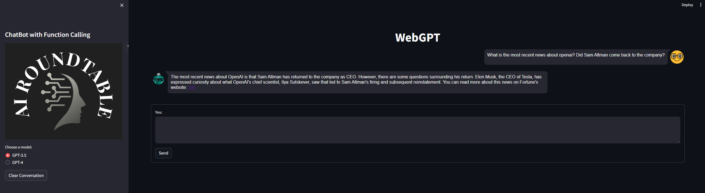
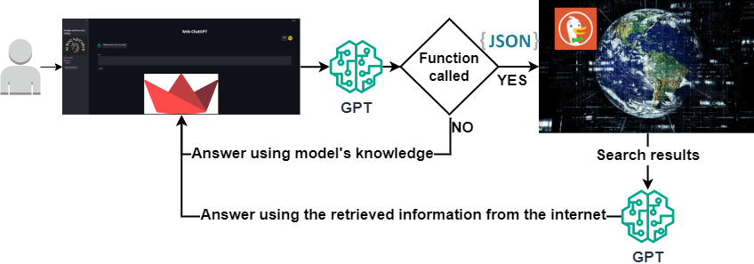

# Function calling and addressing the LLM knowledge cut-off with real-time web search using GPT models

**WebGPT** is a powerful tool enabling users to pose questions that require internet searches. Leveraging GPT models:
* It identifies and executes the most relevant given Python functions in response to user queries. 
* The second GPT model generates responses by combining user queries with content retrieved from the web search engine. 
* The user-friendly interface is built using Streamlit
* The web search supports diverse searches such as text, news, PDFs, images, videos, maps, and instant responses. 
* Overcoming knowledge-cutoff limitations, the chatbot delivers answers based on the latest internet content.

## Streamlit User Interface
<div align="center">
  
</div>

### The link in the response of the model to the query in the previous image
<div align="center">
  
</div>

## Project Schema
<div align="center">
  
</div>

## Running the Project

To get the project up and running, you'll need to set up your environment and install the necessary dependencies. You can do this in two ways:

### Option 1: Using the Parent Directory Instructions
Activate your environment and run:
```
pip install -r requirements.txt
```

### Option 2: Installing Dependencies Individually
If you prefer to install the dependencies individually, run the following command:

```
pip install streamlit==1.29.0 streamlit-chat==0.1.1 duckduckgo-search==4.1.1 openai==0.28.0 pydantic==2.5.1
```

1. **Configuration and Execution**
* Navigate to the config directory.
* Open cfg.py and fill in your GPT API credentials.
2. **Activate Your Environment.**
3. **Ensure you are in the WebGPT directory**
4. **Run the Application:**

In Terminal:

```
streamlit run src\webgpt_app.py
```

**YouTube video:** [Link](https://www.youtube.com/watch?v=55bztmEzAYU&t=295s)

**Slides:** [Link](https://github.com/Farzad-R/LLM-Zero-to-Hundred/blob/master/presentation/presentation.pdf)

Extra read:
- [GPT model](https://platform.openai.com/docs/models/overview) 
- [duckduckgo-search](https://pypi.org/project/duckduckgo-search/)
- [streamlit](https://docs.streamlit.io/)


