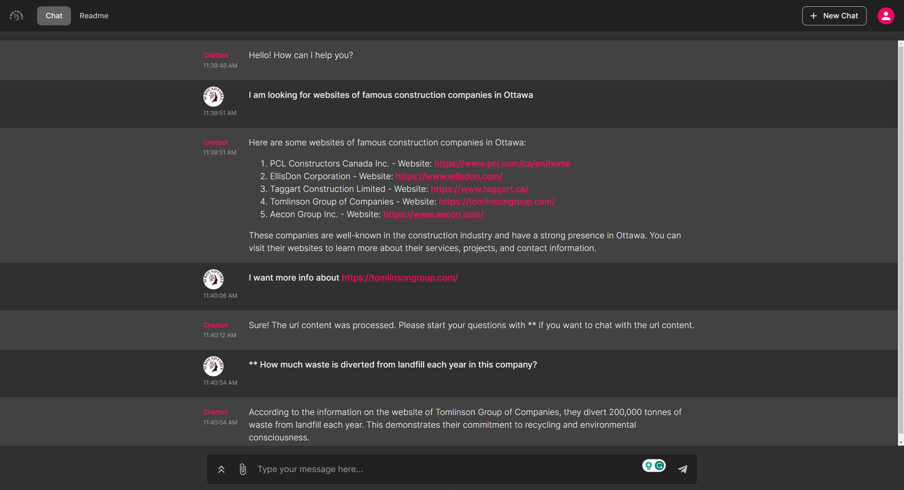
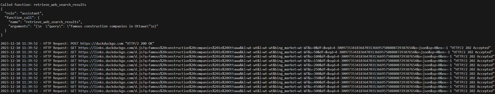
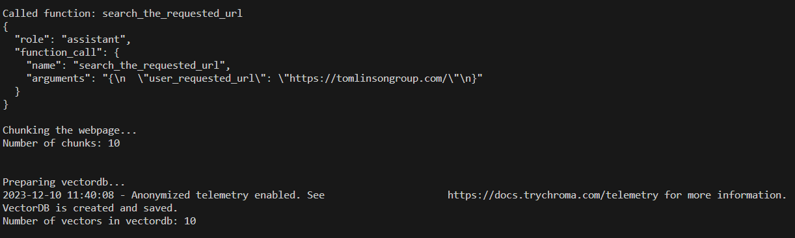

# WebRAGQuery: Combining WebGPT and RAG-GPT

**WebRAGQuery** WebRAGQuery is a powerful chatbot, built with OpenAI GPT model in chainlit user interface, that harnesses the power of GPT agents, function calling, and RAG to offer an enhanced conversational experience. 

#### Here's how you can make the most of its diverse functionalities:
**Normal ChatGPT Interaction:**
Engage in natural conversations as you would with a regular ChatGPT app, experiencing seamless communication.

**Chat with Websites using RAG:**
Unleash the potential of the #RAG technique by sharing a website link with the chatbot. Initiate in-depth discussions and pose detailed questions about the content of the specified website.

**Website Summarization:**
Request the chatbot to provide a comprehensive summary of an entire website in a single interaction. Streamline your information retrieval process with this efficient summarization feature.

**Web Search with DocDocGo Integration:**
Access the vast knowledge of the web by leveraging the chatbot's connection to the DocDocGo search engine. Simply input your query, and watch as the chatbot fetches relevant links and information from the web in response.

## Chainlit User Interface
<div align="center">
  
</div>

### Tomlinson Website:
<div align="center">
  
</div>

### LLM function caller log for the first query shown in chainlit user interface image 
<div align="center">
  
</div>

### LLM function caller log for the second query shown in chainlit user interface image 
<div align="center">
  
</div>

## Project Schema
<div align="center">
  
</div>

## Running the Project

To get the project up and running, you'll need to set up your environment and install the necessary dependencies. You can do this in two ways:

### Option 1: Using the Parent Directory Instructions
Activate your python environment and run:
```
pip install -r requirements.txt
```

### Option 2: Installing Dependencies Individually
If you prefer to install the dependencies individually, run the following command:

```
pip install chainlit==0.7.700 duckduckgo-search==4.1.1 openai==0.28.0 chromadb==0.4.22 fake-useragent==1.4.0 pydantic==2.5.1 langchain==0.0.354 bs4==0.0.1 tiktoken==0.5.2 pandas==2.1.4
```

1. **Configuration and Execution**
* Navigate to the config directory.
* Open cfg.py and fill in your GPT API credentials.
2. **Activate Your Environment.**
3. **Ensure you are in the WebRAGQuery directory**
4. **Run the Application:**

In Terminal:

```
chainlit run src\app.py -h
```

The project includes an automatic directory creation feature within the WebRAGQuery directory. Specifically, it generates two folders:

1. `memory`: This directory is designed to store essential information for each user session. It will create and maintain a separate CSV file for each session, preserving the chat history.
2. `vectordb`: This directory is dedicated to holding chromaDB folders, each corresponding to a specific URL requested by the user. At the onset of each session, this folder is regenerated, ensuring a clean slate. Any existing vectorDBs from previous sessions are automatically purged to maintain a tidy and up-to-date workspace.

## Sample prompts
Sample prompts for triggring different functionalities of the Chatbot:

1. To prepare a website for RAG: `Prepare this link for q and a <your desired link>`
2. To give a full summarization of a website: `summarize this website for me <your desired link>`
3. To search the web for a specific content (e.g videos): `I am looking for videos that explain how to train a large language model`
4. To use its own knowledge (e.g debug a python code): `debug the following code <your code and the error>`

**YouTube video:** [Link](https://www.youtube.com/watch?v=KoWjy5PZdX0&t=266s)

**Slides:** [Link](https://github.com/Farzad-R/LLM-Zero-to-Hundred/blob/master/presentation/presentation.pdf)

**Extra read:**
- [GPT model](https://platform.openai.com/docs/models/overview) 
- [duckduckgo-search](https://pypi.org/project/duckduckgo-search/)
- [chainlit](https://docs.chainlit.io/get-started/overview)
- [Langchain](https://python.langchain.com/docs/get_started/quickstart)
- [ChromaDB](https://www.trychroma.com/)


